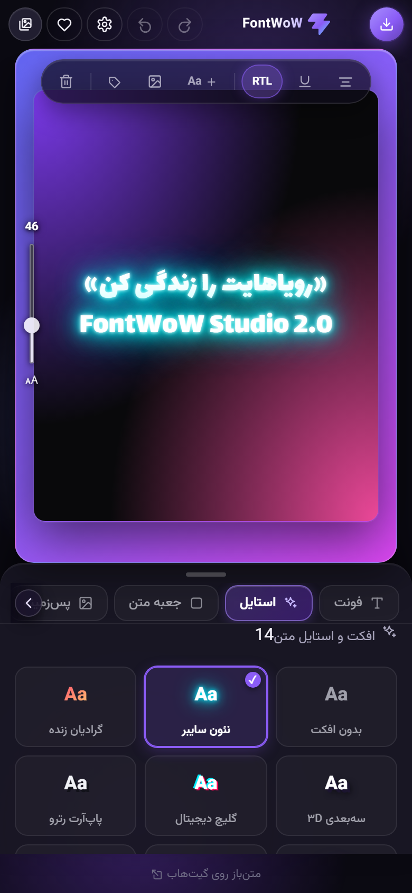
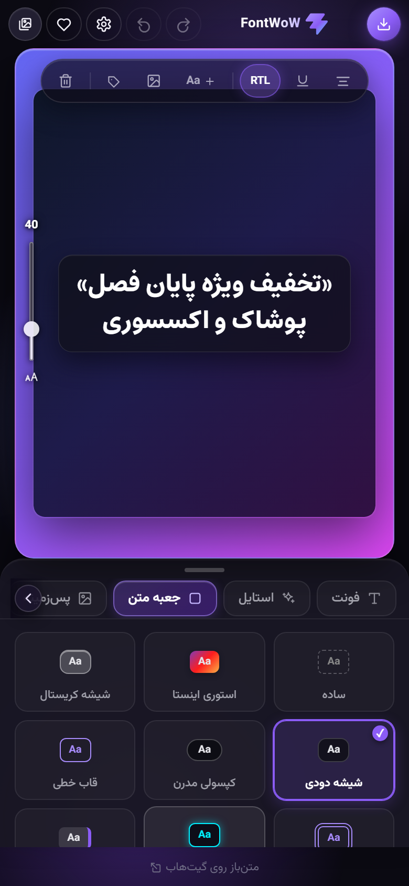
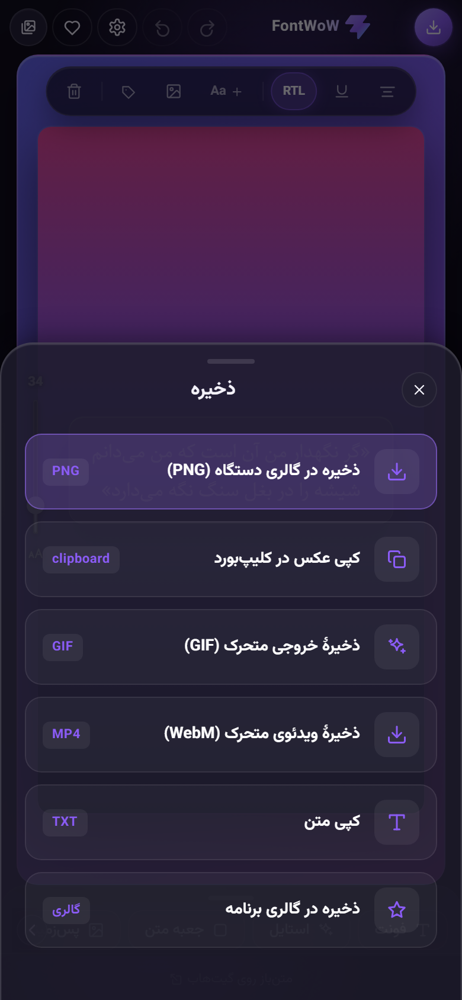

<div align="center">


# FontWoW

**متن‌آرایی آنلاین — بنویس، استایل بده، عکس بگیر ⚡**

[](https://github.com/FontWoW/FontWoW.github.io/actions/workflows/deploy.yml)
[](https://github.com/FontWoW/FontWoW.github.io/actions/workflows/security.yml)
[](https://github.com/FontWoW/FontWoW.github.io/actions/workflows/zap-scan.yml)
[](https://react.dev/)
[](https://vitejs.dev/)

**اجرا: [fontwow.github.io](https://fontwow.github.io)**

<table>
  <tr>
    <td></td>
    <td></td>
    <td></td>
  </tr>
</table>

</div>

<div dir="rtl">

ابزار وب متن‌آرایی، مخصوص موبایل — متن بنویس، فونت و استایل انتخاب کن، و خروجی عکس بگیر یا کپی کن.

بدون نصب، بدون حساب کاربری، کاملاً رایگان و سمت کاربر (client-side). هیچ داده‌ای به سرور فرستاده نمی‌شود و همه‌چیز (طرح‌های ذخیره‌شده، تنظیمات، فونت‌های دلخواه) در `localStorage` مرورگر خودت می‌ماند.

## امکانات

### فونت
- ده‌ها فونت آماده، دسته‌بندی‌شده بر اساس زبان: فارسی، عربی، انگلیسی، ژاپنی، کره‌ای، چینی، روسی، هندی و بیشتر
- آپلود فونت دلخواه خودت (فرمت‌های `ttf` / `otf` / `woff` / `woff2`) — به‌صورت محلی بارگذاری و در گالری فونت‌هایت ذخیره می‌شود
- فرم «پیشنهاد فونت» در بخش حمایت مالی، برای درخواست اضافه‌شدن فونت جدید

### استایل متن
- بولد، ایتالیک، زیرخط
- سایه، دورخط با ضخامت قابل تنظیم
- شفافیت متن

### جعبه‌ی متن
- چند استایل پیش‌فرض: ساده، جعبه‌ی رنگی، زیرخط ضخیم، قاب، شیشه‌ای (glass)

### افکت متن و قالب‌های آماده
- افکت گرادیان (چند گرادیان رنگی) و افکت نئون روی متن
- متن روی مسیر با حالت‌های قوس، موج و دایره و کنترل شدت خمیدگی
- سایهٔ سه‌بعدی با عمق، زاویه و رنگ قابل تنظیم و ماسک تصویر داخل حروف
- کشیدهٔ هوشمند برای متن فارسی
- تب «قالب‌ها» با پیش‌نمایش زنده‌ی پس‌زمینه: ترکیب‌های آماده‌ی فونت + رنگ + جعبه + پس‌زمینه + افکت برای شروع سریع

### ابزارهای جادویی
- ساخت چند چیدمان حرفه‌ای با یک لمس و مرتب‌سازی خودکار لایه‌ها
- حذف محلی پس‌زمینهٔ سادهٔ عکس‌ها و استیکرها، بدون آپلود فایل

### چند لایه‌ی متن و استیکر
- افزودن لایه‌های متن مستقل روی بوم (دکمه‌ی ＋ Aa)
- افزودن لایه‌ی عکس/استیکر دلخواه از گالری گوشی (دکمه‌ی ＋ کنار آیکون عکس)
- جابجایی با کشیدن (drag)، چرخش با دستگیره‌ی چرخش، تغییر اندازه (برای لایه‌ی عکس)، ویرایش متن با دابل‌کلیک، حذف با ✕

### چیدمان
- اندازه‌ی فونت، فاصله‌ی حروف، فاصله‌ی خطوط
- چیدمان متن (راست / وسط / چپ) و حاشیه
- نسبت ابعاد خروجی: آزاد، استوری ۹:۱۶، مربعی ۱:۱، پست عمودی ۴:۵، لندسکیپ ۱۶:۹

### رنگ و پس‌زمینه
- رنگ متن دلخواه
- پس‌زمینه: رنگ ساده، گرادیان، قالب‌های آماده به تفکیک دسته، یا آپلود عکس دلخواه خودت
- فیلتر روی عکس پس‌زمینه: روشنایی، کنتراست، بلور، سیاه‌وسفید

### خروجی و ذخیره
- خروجی PNG با کیفیت بالا (خروجی همیشه تمیز است — هیچ عنصری از رابط کاربری داخل عکس نمی‌افتد)
- خروجی GIF و ویدئوی WebM با افکت ورود، محوشدن، بزرگ‌نمایی یا تایپ
- کپی مستقیم عکس در کلیپ‌بورد
- کپی متن ساده
- ذخیره‌ی طرح‌ها در گالری داخل برنامه برای استفاده‌ی بعدی

### ظاهر و طراحی
- تم تیره‌ی بنفش با پس‌زمینه‌ی متحرک (aurora) و انیمیشن‌های SVG — لوگو، تب‌ها، شیت‌ها، اسلایدرها و نوتیفیکیشن‌ها همه انیمیشن دارند
- **رنگ تم قابل انتخاب** — کل رابط کاربری (دکمه‌ها، درخشش‌ها، اسلایدرها، لوگو) با رنگ انتخابی شما هماهنگ می‌شود
- تمام آیکون‌ها SVG دست‌ساز هستند؛ هیچ کتابخانه‌ی UI اضافه‌ای استفاده نشده
- احترام به `prefers-reduced-motion` برای کاربرانی که انیمیشن نمی‌خواهند

### تنظیمات برنامه ⚙️
از آیکون تنظیمات در بالای صفحه قابل دسترسی است:
- **رنگ تم برنامه** — انتخاب از ۸ رنگ آماده
- **زبان برنامه** — چندزبانه؛ فعلاً **فارسی** و **English** پشتیبانی می‌شوند. با تغییر زبان، جهت صفحه (RTL/LTR) هم به‌صورت خودکار عوض می‌شود
- **ارتباط با ما** و لینک مخزن متن‌باز
- **بازگردانی تنظیمات** به حالت پیش‌فرض

## چندزبانه بودن (i18n)

تمام متن‌های رابط کاربری در فایل [`src/strings.js`](src/strings.js) نگه‌داری می‌شوند و بر اساس کلیدهای مشترک بین زبان‌ها تعریف شده‌اند. برای افزودن زبان جدید:

1. یک آبجکت جدید با کد زبان (مثلاً `ar`) به `STRINGS` در `src/strings.js` اضافه کن و همه‌ی کلیدهای موجود در `fa`/`en` را برایش ترجمه کن.
2. دکمه‌ی انتخاب زبان مربوطه را در بخش تنظیمات (`src/App.jsx`) اضافه کن.
3. اگر زبان جدید راست‌به‌چپ است، آن را در منطق تعیین `dir` (در `src/App.jsx`) لحاظ کن.

انتخاب زبان کاربر در `localStorage` (کلید `fontwow_app_settings_v1`) ذخیره و در بازدیدهای بعدی بازیابی می‌شود.

## توسعه

```bash
npm install
npm run dev      # سرور توسعه
npm run lint     # لینت با oxlint
npm run build    # ساخت نسخه‌ی نهایی در dist/
npm run preview  # پیش‌نمایش نسخه‌ی buildشده
```

خروجی build با گیت‌هاب اکشن به‌صورت خودکار روی GitHub Pages منتشر می‌شود.

## مستندات پروژه

- [راهنمای مشارکت](CONTRIBUTING.md)
- [راه‌اندازی و توسعه](docs/DEVELOPMENT.md)
- [معماری](docs/ARCHITECTURE.md)
- [راهنمای تست](docs/TESTING.md)
- [فرآیند انتشار](docs/RELEASING.md)
- [پشتیبانی](SUPPORT.md)
- [سیاست امنیت](SECURITY.md)
- [منشور رفتاری](CODE_OF_CONDUCT.md)

## امنیت

کد برنامه و نسخه‌ی آنلاین به‌صورت خودکار با **GitHub CodeQL**، بررسی آسیب‌پذیری وابستگی‌ها و **OWASP ZAP** اسکن می‌شوند. وضعیت آخرین اسکن‌ها در badgeهای بالای همین صفحه و جزئیات آن‌ها در بخش Actions/Security گیت‌هاب قابل مشاهده است. روش گزارش خصوصی آسیب‌پذیری و دامنه‌ی اسکن‌ها در [`SECURITY.md`](SECURITY.md) توضیح داده شده است.

هر فایل APK نیز پیش از انتشار با **VirusTotal** بررسی می‌شود. لینک عمومی نتیجه‌ی اسکن و SHA-256 فایل به‌صورت خودکار داخل توضیحات همان Release قرار می‌گیرد و در صورت تشخیص فایل مشکوک یا مخرب، انتشار نسخه متوقف می‌شود.

عبور از اسکن خودکار به معنی تضمین نبودن مطلق آسیب‌پذیری نیست، اما یک کنترل امنیتی مستمر و قابل بررسی عمومی فراهم می‌کند.

## ساختار پروژه

```
src/
  App.jsx      رابط کاربری اصلی و منطق برنامه
  App.css      استایل‌ها و انیمیشن‌ها (design tokens)
  icons.jsx    مجموعه آیکون‌های SVG دست‌ساز + لوگوی متحرک
  fonts.js     تعریف فونت‌ها، دسته‌بندی‌ها، پس‌زمینه‌ها و قالب‌ها
  strings.js   متن‌های چندزبانه (فارسی/انگلیسی)
  index.css    توکن‌های طراحی و استایل‌های پایه
  main.jsx     نقطه‌ی ورود React
```

## نکته‌ی مهم برای توسعه‌دهنده‌ها

عنصر بوم (`.stage-inner`) مستقیماً با `html-to-image` به PNG تبدیل می‌شود. **هیچ عنصر تزئینی یا UI نباید داخل این عنصر رندر شود** وگرنه وارد عکس خروجی کاربر می‌شود. تمام افکت‌های ظاهری (aurora، درخشش، قاب) به‌صورت sibling خارج از آن پیاده شده‌اند.

## تکنولوژی‌ها

- [React 19](https://react.dev/) + [Vite](https://vitejs.dev/)
- [html-to-image](https://github.com/bubkoo/html-to-image) برای تبدیل طرح به PNG
- فونت‌ها از [Google Fonts](https://fonts.google.com/)
- بدون هیچ کتابخانه‌ی UI یا آیکون — همه‌چیز CSS و SVG خالص

## مجوز

منتشر شده تحت مجوز [GPL-3.0](LICENSE) — استفاده، تغییر و توسعه‌ی آزاد، با رعایت شرایط این مجوز.

</div>

---

## English

**FontWoW** is a free, mobile-first, client-side text-styling web app: type your text, pick from dozens of Google Fonts (grouped by language, RTL-aware) or upload your own, style it with colors, gradients, neon effects, text boxes, draggable layers, and backgrounds — then export a clean high-res PNG or copy it straight to the clipboard. Nothing is sent to any server; designs, settings, and custom fonts live in your browser's `localStorage`.

The UI is a violet "aurora" dark theme with hand-rolled SVG icons and animations (no UI libraries), a user-selectable accent color that re-tints the whole interface, full Persian/English localization with automatic RTL/LTR switching, and `prefers-reduced-motion` support.

```bash
npm install && npm run dev
```

Built with React 19 + Vite, deployed to GitHub Pages via GitHub Actions. Open source — use it, fork it, improve it.

## License

Licensed under [GPL-3.0](LICENSE).
